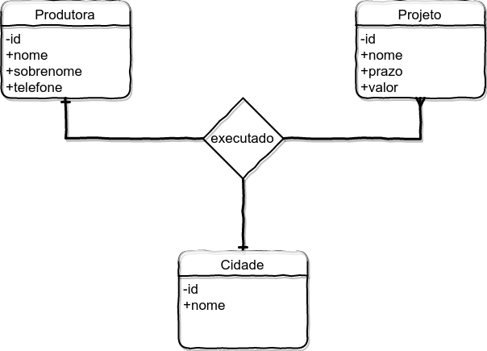

# Gabarito

1. a(**F**), b(**V**), c(**F**), d(**V**)

2. a(**X**)

3. Carlos, técnico de informática, dá manutenção em computadores e cobra preços mínimos e máximos a depender do  serviço, quando solicitado.

- Entidades:
    1. computador – objeto a ser consertado, modificado, adaptado. Que recebe o “serviço”;
    2. Tecnico – responsável em dar manutenção no computado;
    3. Cond_preco – valor cobrado em condições situacionais.

- Atributo:
    - Computador: id_computador, modelo, fabricante, SO
    - Tecnico: id_tecnico, nome, sobrenome, telefone
    - Cond_preco: id_cond_preco, preco_min, preco_max.

- Associação:
    - Cada *Computador* **deve ser** *consertado* por **um único** *Técnico*
    - Cada *Técnico* **pode ter** *consertado* **um ou mais** *Computadores*
- Fundamental
    - Cada *Cond_preco* **pode ser** o menor ou o maior.

4. Resposta:
- Cada *Estudante* **deve ter** *cursado* **uma ou mais** *Disciplinas* que **devem ser** de **um único** *Curso*.
- Cada *Opcao_disciplina* **pode ser** obrigatória ou não.

5. Resposta:

    

[Localize-se: lista das aulas](https://github.com/tmenegaz/db_dendezeiros/blob/master/assunto/lista.md#lista-de-aulas)
