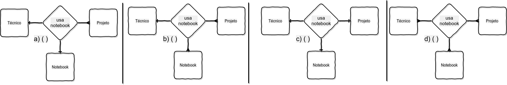

# Gabarito

## Q1

> 1ª rega: Uma coluna com dados atômicos não pode conter muitos valores do mesmo tipo de dados naquela coluna.

Entidade_cliente

|nome|idade|telefone|
|-------|------|---------|
|Ana|25|995643211|
|Luiza|41|99675432|
|Ana|21|995678762|
|Fernada|41|987765432|

Entidade_loja

|produto|validade|quantidade|
|-------|------|---------|
|café|12/09/2018|200|
|farinha trigo|09/01/2019|320|
|café|16/02/2018|20|
|farinha trigo|09/01/2019|110|

> 2ª regra: Uma tabela com dados atômicos não pode conter múltiplas colunas com o mesmo tipos de dados.

Entidade_cliente

|nome|idade|telefone|ddd|
|-------|------|---------|-----|
|Ana|25|995643211|71|
|Luiza|41|99675432|71|
|Ana|21|995678762|81|
|Fernada|41|987765432|81|

Entidade_loja

|produto|validade|quantidade|origem|
|-------|------|---------|--------|
|café|12/09/2018|200|Brasil|
|farinha trigo|09/01/2019|320|Argentina|
|café|16/02/2018|20|Brasil|
|farinha trigo|09/01/2019|110|Argentina|

## Q2

> a) (V); b) (V), c) (F), d) (V)

## Q3

Entidade_imóvel_dados_brutos

|número|nome_rua|tipo_propriedade|preço|
|------|---------|---------|---------|
|59|Rua dos alagados|condomínio|R$ 180.000,00|
|849|Rua da ilha|sobrado|R$ 90.000,00|
|32|Rua dos alagados|casa|R$ 95.000,00|
|65|Rua barro vermelho|condomínio|R$ 180.000,00|
|178|Rua da ilha|sobrado|R$ 90.000,00|

Entidade_nome_rua

|Id_nome_rua|nome|
|-------|------|
|11|Rua dos alagados|
|12|Rua da ilha|
|13|Rua barro vermelho|

Entidade_tipo_propriedade

|Id_tipo_propriedade|tipo|
|-------|------|
|21|casa|
|22|condomínio|
|23|sobrado|

Entidade_preço

|Id_preço|preço|
|-------|------|
|31|180|
|32|90|
|33|95|

Entidade_imóvel

|Id_imóvel|número|nome_rua|tipo_propriedade|preço|
|-------|------|---------|---------|---------|
|41|59|11|22|31|
|42|849|12|23|32|
|43|32|11|21|33|
|44|65|13|22|31|
|45|178|11|23|33|

## Q4

> c) (X);  

> Quando todos os 3 relacionamentos são 1 a tabela resultante possui 3 chaves distintas possíveis.  Esse arranjo representa o fato de que 3 DFs são necessárias para descrever esse relacionamento. A restrição de opcionalidade não é utilizada aqui porque  todas as *n* entidades precisam participar do relacionamento para satisfazer as restrições de DF. Toby [et al, 97]

usa_notbook

|Id_tec|Id_projeto|Id_notbook|
|-------|------|---------|
|35|alpha|5001|
|35|gamma|2008|
|42|delta|1004|
|42|epsilon|3005|
|81|gamma|1007|
|93|alpha|1009|
|93|beta|5001|

 
## Q5

> Cada funcionário trabalha em exatamente um departamento, e cada departamento tem pelo  menos um funcionário.

CREATE TABLE departamento(
    num_dep INTEGER,
    nome_depto CHAR(20),
    PRIMARY KEY(num_dep)
    );
CREATE TABLE funcionário(
    Id_func INTEGER,
    nome_func CHAR(20),
    num_dep INTEGER NOT NULL,
    PRIMARY KEY(Id_fun),
    FOREIGN KEY(num_dep) REFERENCES departamento);

[Localize-se: lista das aulas](https://github.com/tmenegaz/db_dendezeiros/blob/master/assunto/lista.md#lista-de-aulas)