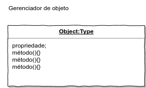

# Exercícios

## 1. Pesquise a fim de conhecer e determinar o que é banco de dados *hierárquico*, de *rede*, *relacional*, de *objeto-relacional* e de *objeto*.

- *Hierárquico*: um gerenciador desse tipo representa dados como uma estrutura em árvore, composto de hierarquia e registros
    - exemplo:
    
   

        Neste caso, há dados específicos em CLIENTE(nome, endereço, cidade, estado etc); os segmentos dependentes de cliente são CHEKCONTA e GRAVACONTA, que tem cada um, conforme a imagem, dois segmentos. Cada um dos segmentos inferiores dependem hierarquicamente dos segmentos superiores. Para elém disso, cada um tem dados específicos. É comum encontar esse gerenciador em ambientes de grande porte, como implementações *IMS[10](#myfootnote10)*

- *Rede*: representa os dados como registros vinculados uns aos outros, formando conjuntos comuns de dados. Existe uma similaridade muito grande entre o modelo hierárquico e o modelo de rede. Pode-se enteder o modelo de rede como uma generalização do modelo hierárquico. No modelo de rede um *filho* pode ter mais de um *pai*.
    - exemplo

   

- *Relacional*: representa os dados como uma simples coleção de linhas e colunas em tabelas bidimensionais.
    - exemplo

    

- *Objeto-Relacional*: Combina o modelo orientado a objetos (*união de propriedades e métodos*) com o modelo relacional(linhas e colunas de tabelas).

- *Objeto*: representa os dados e processos em um único objeto
    - exemplo

    

## 2. O que é uma entidade na abordagem relacional?

> A entidade é um *agrupamento lógico de informações inter-relacionadas* necessárias para a execução das atividades do sistema. Pensando no cilco de vida a entidade é um objeto do mundo real na elicitação dos requisitos: funcionário, cliente, produto, etc. Mas quando não for, contém informações relevantes às operações da empresa.
>
> Quando transportada ao *modelo físico* chamamos a entidade de tabela.
>
> Ao transpor do modelo Relacional para o modelo Orientado a Objeto, a *entidade* passa a ser uma *classe* ou *categoria* do objeto ao qual agregaremos os respectivos métodos.

## 3. Dê exemplos de entidades.

> Como exemplo podemos ter para Pessoa Física ou Jurídica as entidades: Pessoa, Funcionário, Clientes, Fornecedores, Empresa.
>
>Para documentos pode-se ter como exemplo: Ordem de compra, Pedido, Nota fiscal  

## 4. Classifique as entidades.

> As entidades pode ser classificadas em *fundamental* e *associativa*.
>
> - fundamental:  contem dados básicos que são resultados ou alimentadores das operações da empresa
>
> - associativa: é formada pelo relacionamento de duas entidades fundamentais sempre que esta se relacionarem mais de uma vez: aluno X matéria; cd X autor; pedido X produto. É importante dizer que há um caso *específico* para a entidade associativa: *sempre que, além do simples relacionamento entre duas entidades fundamentais, houver outras informações específicas da nova entidade criada (quantidade e valor entre pedido e produto) ela será chamada de entidade associativa atributiva*.

## 5. O que é um atributo na abordagem relacional?

> O atributo é o *item de dado* que qulifica uma entidade e descreve seus elementos ou características. Quando evolui-se para o projeto físico do modelo chamamos o atributo de campo ou coluna.

## 6. Exemplifique atributos.

> Exemplo de atributos para uma entidade Pessoa: nome, sobrenome, endereço, RG, CPF.
>
> Exemplo para entidade Nota fiscal: série, número, data de emissão, cliente, valor.

## 7. O que é uma tupla na abordagem relacional?

> A tupla é uma estrutura de atributos que residem em uma entidade.
>
> Quando transposta para o modelo físico uma tupla é chamada de registro ou linha da tabela (entidade).

## 8. Qual a diferenção entre dado e informação?

> O dado é a unidade básica da informação e a informação é um conjunto de dados organizados logicamente a fim de gerar sentido.

## 9. O que é SGBD?

> Um Sistema Gerenciador de Banco de Dados é uma coleção de programas para *criar* estruturas, *manter* dados, *gerenciar* as *transações* efetuadas e a *extração* das informações. Tudo isso com rapidez e segurança.
>
> Algumas características principais:
>
> - *controle de redundância* - as informações devem possuir um mínimo de redundância para ser ser um meio de garatir a estabilidade do modelo.
> - *compartilhamento de dados* - as informações devem estar disponível para qualquer número de usuários de forma concomitante e segura.
> - *controle de acesso* - necessidade de saber quem pode realizar qual função dentro do banco de dados.

## 10. Apresente 3 exemplos de SGBD e suas principais características.

## 11. Em TI, por que é importante o descolamento ou desacoplamento?

> O desacoplamento é a *separação de responsabilidades*. Segundo Robert C. Martin, nos ensina, deve-se desenvolver software sobre a regra da *responsabilidade única*. Essa coesão deve ser realizada por uma classe de maneira satisfatória. Dessa forma, fica fácil desacoplar ou descolar uma parte da aplicação sem comprometer as demais.

## 12. O que é independência de dados?

> Quando se prima pela *independência de dados* em um projeto de banco de dados, está a se previnir com relação a futuras necessidades de reorganização e conversão do banco de dados. Posto isso, fica evidente a utilização da regra da responsabilidade única no projeto. Então, a *independência de dados* é a capacidade de fazer mudanças em uma estrutura lógica ou física de banco de dados sem exigir reprogramação dos programas de aplicação.

## 13. O que é uma chave?

> A chave é um atributo utilizado para indexar dados. São 3 os tipos de chave:
>
> - chave primária - é o atributo que permite identificar a ocorrência de uma única tupla (linha) em uma entidade. Os demais atributos, da entidade, devem depender unicamente desse atributo chave.  Eventualmente a chave pode ser determinada pela união de um atributo com outro atributo ou mais. Nesses casos a chave será chamada de chave concatenada.
>  
> - chave estrangeira - é o atributo chave de uma entidade que estabelece a relação de uma entidade com a chave primária de outra entidade. Sendo assim, permitindo a relação entre entidades.
>
> - chave secundária - Sempre que houver a necessidade de buscar informaçãoes semelhantes, em ordem crescente ou não, em função de data, valores ou status predefinidos, cria-se chaves secundárias. Essas chaves também podem ser concatenadas a outras chaves secundárias pra extrair a informação desejada. Portanto, a chave secundária é utilizada como meio de classificar e pesquisar nas entidades.

## 14. Para que serve a linguagem SQL?

> A SQL serva para a criação de componentes de banco dados como tabelas e índices; para a manipulação dos dados armazenados no banco de dados; para extrair dados do banco de dados e para prover a segurança interna do banco de dados.

## 15. O que é GRANT e REVOKE em DCL?

> GRANT é a concessão de acesso
>
> REVOKE é a revogação da concessão.  

## 16. Qual a diferença entre sistema de banco de dados e sistema de gerenciados de banco de dados?

## 17. Faça um diagrama que ilustre a resposta da questão 16.

## 18. Por que a linguagem SQL não é considerada uma linguagem procedural?

> Por meio da SQL é possível especificar o *que deve ser feito* e não como deve ser feito. Essa caracteristica de *como deve ser feito* é muito própria das linguagens procedurais.

## 19. Como instalar um SGBD em um sistema operacional?

## 20. O que é clustering?

> "Clustering é uma técnica de Data Mining para fazer agrupamentos automáticos de dados segundo seu grau de semelhança. O critério de semelhança faz parte da definição do problema e, dependendo, do algoritmo." [wikipedia](https://pt.wikipedia.org/wiki/Clustering) 

[Voltar ao assunto: Conceitos](https://github.com/tmenegaz/db_dendezeiros/blob/master/assunto/introducao.md#conceitos)

[Localize-se: lista das aulas](https://github.com/tmenegaz/db_dendezeiros/blob/master/assunto/lista.md#lista-de-aulas)