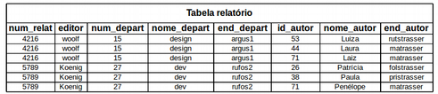
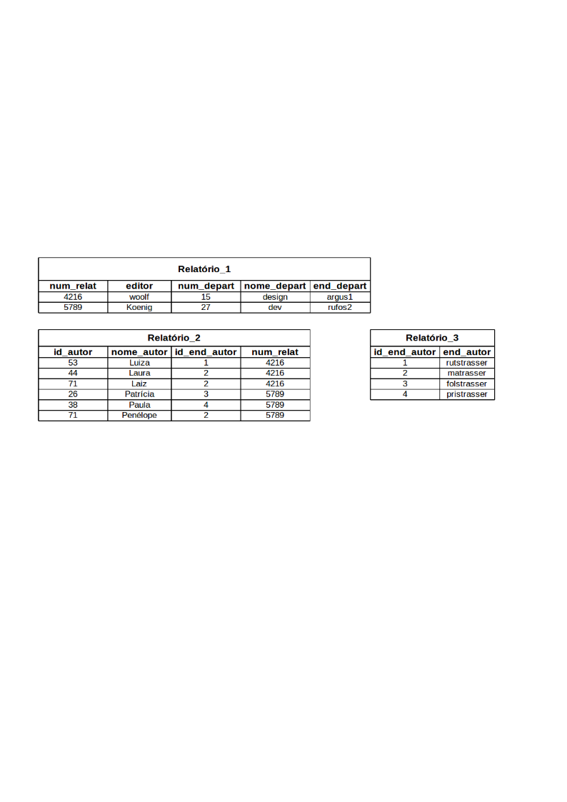
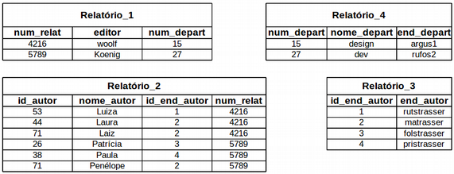

# Normalização

Segundo Oliveira (p. 51), "a normalização de dados é uma sequência de etapas sucessivas que, ao final, apresentará uma modelo de dados estável com um mínimo de redundância."

Existem `5` regras que se aplicam a *Banco de dados*, são as *formas normais* - **FN**. As regras sãoo classificadas como 1ªFN, 2ªFN, 3ªFN, 4ªFN e 5ªFN.

Tomemos essa tabela como exemplo:

## Primeira forma normal

Dizemos que uma tabela está na primeira forma normal `1FN` *se*, *e somente se* todas as colunas tiverem apenas [valores atômicos](https://github.com/tmenegaz/db_dendezeiros/blob/master/assunto/exercicios1.md#8-qual-a-diferenção-entre-dado-e-informação), ou seja, sa cada coluna tiver apenas um valor para cada linha da tabela.  
Aplicando a `1FN` no relatório com dados brutos tem-se:

## Segunda forma normal

Dizemos que uma tabela está na segunda forma normal `2FN` *se*, *e somente se* ela estiver na `1FN` e os *atributos* **não** `chave` forem *totalmente dependentes* da `fk`. Um *atributo* será totalmente dependente da `fk` se estiver do lado direito de uma **dependência fumcional** - `DF` que tem no lado esquerdo a própria `fk` ou algo que possa ser derivado da `fk` usando a **transitividade** das `DF`. A *transitividade* das `DF` é a *derivação* da `DF` em outras tabelas. 

É denominada de **dependência funcional** - `DF` a *propriedade de um ou mais atributos* **determinarem** **unicamente** o **valor** de *um ou mais outros atributos*.
Então imaginemos uma tabela `R` com um conjunto de atributos `B` e um conjundo de atributos `A`.  
O conjunto de atributos `R.B` é *dependente funcionalmente* do outro conjunto de atributos `R.A` se, em qualquer momento do tempo, cada valor `R.A` estiver **associado** a **apenas um valor** `R.B`. Essa `DF` é indicada por `R.A -> R.B` que deve ser lida como: `R.A determina funcionalmente R.B`.

Aplicando a `2FN` tem-se:

## Terceira forma normal

Dizemos que uma tabela está na terceira forma normal `3FN` *se*, *e somente se* ela estiver na `2FN` e, ainda, para cada `DF` não trivial `X -> A` `(X determina funcionalmente A)`, onde `X` e `A` são *atributos* simples ou compostos, uma das duas condições precisar ser mantida, a saber:

- ou o *atributo* `X` é uma `super chave` e, por isso, `A` é totalmente dependente de `X`;
- ou o *atributo* `A` é membro de uma chave candidata.

Então, sendo o *atributo* `A` membro de uma chave candidata, `A` será chamado de **atributo primo** ou **mutuamente independente**. O que quer dizer que para um conjunto de `2` ou mais atributos, não chave, nenhum deles é *funcionalmente dependente* de `1` dos outros. Na prática o que se pode notar, quando na `3FN`, é que tal atributo pode ser atualizado de forma independente de todo o resto.

Para saber mais acesse um link externo:
- [USP - introdução ao banco de dados](https://www.ime.usp.br/~jef/apostila.pdf)
- [Modelagem de dados](http://unilivros.com.br/pdf/dbmod.pdf)

---

Para ilustrar a utilização das *FNs* vamos estudar esse pequeno caso e normalizar até onde for possível.

Para um caso em que músicos especialistas de uma orquestra tocam em um dos naipes, apenas. Sendo estes naipes madeira, corda, metal e percurssão e um destes músicos epecialista pode ser o chefe de um naipe. A orquestra costuma ter o histórico de seu músicos para cada concerto realizado disponibilizando fotos e vídeos das apresentações ou ensaios. Os concertos são elaborados a partir da definição e arranjo dos naipes necessários para a execução de cada obra composta. É elborado um release de cada músico, nipe, inistrumento e concerto executado pela orquestra para alimentar o hitórico, o currículo dos músico e pesquisas em geral sobre a música.

> [Análise desenvolvida para o caso orquestra](https://github.com/tmenegaz/db_dendezeiros/blob/master/assunto/respCaso6.md#caso-orquestra)

Analise os requisitos e faça a normalização dos [casos](https://github.com/tmenegaz/db_dendezeiros/blob/master/assunto/casos.md#estudos-de-caso)

[Próxima aula -> O modelo lógico](https://github.com/tmenegaz/db_dendezeiros/blob/master/assunto/logico2fisico.md#modelo-lógico)

[Localize-se: lista das aulas](https://github.com/tmenegaz/db_dendezeiros/blob/master/assunto/lista.md#lista-de-aulas)
