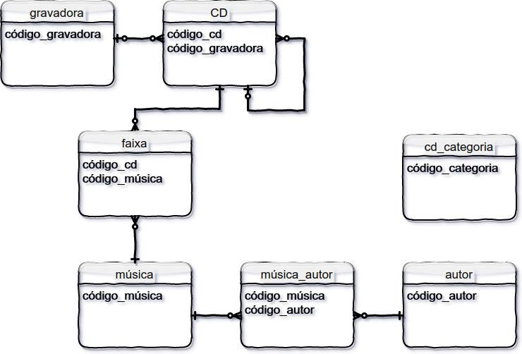

# Laboratório

O primeiro caso a ser estudados para a transposição é o da [Loja de CDs](https://github.com/tmenegaz/db_dendezeiros/blob/master/assunto/respCaso1.md#caso-loja-de-cds). A elicitação de requisitos nos levou uma visão específica representada em um modelo lógico com diagramas. Após análisar e conciliar os diferentes diagramas com seus esquemas de relacionamento, temos o seguinte diagrama

