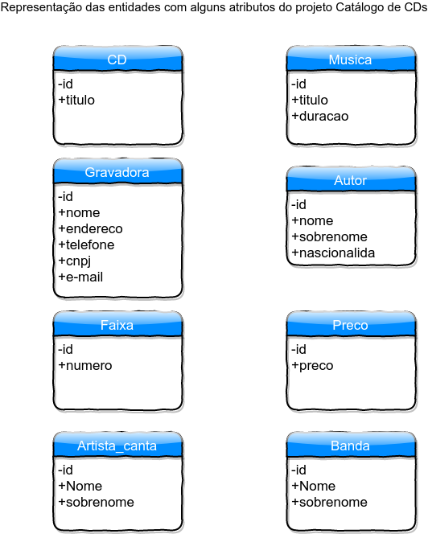
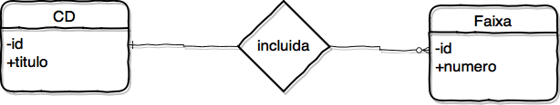
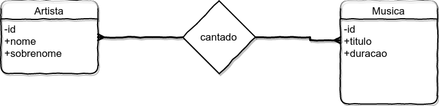

# Caso Loja de CDs

- [Voltar para o caso Loja de CDs](https://github.com/tmenegaz/db_dendezeiros/blob/master/assunto/casos.md#loja-de-cds)

## Prática

- [Voltar para o enunciado da prática do catálogo de CDs](https://github.com/tmenegaz/db_dendezeiros/blob/master/assunto/casos.md#pratique)

> Nomo do projeto: **Católodo de CDs**
>
> Contratante: **Maria**
>
> Entidades identificadas:
>
> 1. CD - produto da venda que indica outro produto CD
> 2. Musica - conteúdo do CD
> 3. Gravadora - fornecedor do CD
> 4. Autor - cria a música
> 5. Faixa - forma de organização das músucas no CD
> 6. categoria - valores mínimos e máximos do preço de venda do produto CD
> 7. Artista - conteúdo do CD
> 8. Banda - conteúdo do CD
>
> Representação das entidades com alguns atributos, do projeto Catalógo de CDs
>
> 
> 

## Relacionamento

- [Voltar para o enunciado do relacionamentos do catálogo de CDs](https://github.com/tmenegaz/db_dendezeiros/blob/master/assunto/casos.md#relacionamento)

> - **Cada** *CD* **pode ser** *gravado* por **uma única** *gravadora*.
> - **Cada** *gravadora* **pode ter** *gravado* **um ou mais** *CDs*.
>
> 
>
> - **Cada** *CD* **pode ter** *indicado* **um ou mais** *CDs*.
>
> 
> 
> - **Cada** *CD* **deve ter** *precificado* **um único** *Preço*.
> - **Cada** *Preço* **deve estar** *precificado* em **um ou mais** *CDs*.
>
> 
> 
> - **Cada** *CD* **deve ter** *garavado* **uma ou mais** *músicas*.
> - **Cada** *música* **deve estar** *garavada* em **um ou mais** *CDs*.
> 
> 
>
> **OBS**
> Cd tem relação com música ou tem relação  com faixa?
> Se a música tem relação com faixa então a música não precisa ter relação com CD?
> o que acham?
> 
> - **Cada** *Faixa* **deve estar** *incluida* em **um único** *CD*.
> - **Cada** *CD* **pode ter** *incluido* **uma ou mais** *Faixa*
>
> 
>
> - **Cada** *Faixa* **deve ter** *referenciado* **uma única** *música*.
> - **Cada** *música* **pode estar** *referenciada* em **uma ou mais** *Faixas*.
> 
> 
>
> - **Cada** *Autor* **deve ter** *composto* **uma ou mais** *músicas*.
> - **Cada** *música* **pode ser** *composta* por **um ou mais** *Autores*.
> 
> 
>
> - **Cada** *Artista* **deve ter** *cantado* **uma ou mais** *músicas*.
> - **Cada** *música* **pode ser** *cantada* por **um ou mais** *Artistas*
> 
> 
>
> - **Cada** *Música* **deve ser** *tocada* por **uma ou mais** *Bandas*.
> - **Cada** *Banda* **pode ter** *tocado* **uma ou mais** *Música*.
> 
> 
>
> - **Cada** *Banda* **deve ter** *elencado* **um ou mais** *Artistas*.
> - **Cada** *Artista* **pode ser** *elencado* por **uma ou mais** *Bandas*.
> 
> 
>

[Localize-se: lista das aulas](https://github.com/tmenegaz/db_dendezeiros/blob/master/assunto/lista.md#lista-de-aulas)
